<html><head><meta content="text/html; charset=UTF-8" http-equiv="content-type"></head><body class="c14 doc-content">

Table of Conent

<a class="c3" href="#h.rwlpv1buq7p9">Oracle APEX Field Documentation</a>

<a class="c3" href="#h.fiolcc6vyx49">1. Text Input Field</a>

<a class="c3" href="#h.tr0247ktbbuy">1.1 Field Preview</a>

<a class="c3" href="#h.3zr6y2rmxnax">1.2 Defining Field Name and Type</a>

<a class="c3" href="#h.ve5ov14gh1is">1.3 Setting Properties and Values</a>

<a class="c3" href="#h.ki96dhmahe8q">2. Number Input Field</a>

<a class="c3" href="#h.m1zx8dpb41v5">1.1 Field Preview</a>

<a class="c3" href="#h.21svau48ddgf">1.2 Defining Field Name and Type</a>

<a class="c3" href="#h.8iqkcdigac7z">1.3 Setting Properties and Values</a>

<a class="c3" href="#h.2vqtn1your4w">3. E-Mail Input Field</a>

<a class="c3" href="#h.97w45ruzp6h">3.1 Field Preview</a>

<a class="c3" href="#h.t0bglgefqx4o">3.2 Defining Field Name and Type</a>

<a class="c3" href="#h.yphd02lbkux8">3.3 Setting Properties and Values</a>

<a class="c3" href="#h.lllpnhgedb72">4. Dropdown Item</a>

<a class="c3" href="#h.ri8kfufymsu4">4.1 Field Preview</a>

<a class="c3" href="#h.sj78rtodpini">4.2 Defining Field Name and Type</a>

<a class="c3" href="#h.nsuefsjs84z9">4.3 Setting Properties and Values</a>

<a class="c3" href="#h.5qrn2jdd8u5p">5. Radio Group</a>

<a class="c3" href="#h.9sj6iy30yyr">5.1 Field Preview</a>

<a class="c3" href="#h.vs3olf9f5r5w">5.2 Defining Field Name and Type</a>

<a class="c3" href="#h.b3ltb8obpvl7">5.3 Setting Properties and Values</a>

<a class="c3" href="#h.6xpvugblw2h6">6. Selectone - Dropdown Item</a>

<a class="c3" href="#h.d9tsvg5pwqx0">6.1 Field Preview</a>

<a class="c3" href="#h.rc9sypz9srxv">6.2 Defining Field Name and Type</a>

<a class="c3" href="#h.i254a3ivkivp">6.3 Setting Properties and Values</a>

<a class="c3" href="#h.cnwwqzhvw6jk">7. Date Item</a>

<a class="c3" href="#h.sdl005hjrhd1">7.1 Field Preview</a>

<a class="c3" href="#h.lsg7zxf3p6vs">7.2 Defining Field Name and Type</a>

<a class="c3" href="#h.6j2fm4i7gev">7.3 Setting Properties and Values</a>

<a class="c3" href="#h.36356tfwg2y4">8. Combo-Box Item</a>

<a class="c3" href="#h.c5jg4hhmzjr3">8.1 Field Preview</a>

<a class="c3" href="#h.1ya644tvm4ao">8.2 Defining Field Name and Type</a>

<a class="c3" href="#h.jflcljels6hg">8.3 Setting Properties and Values</a>

<a class="c3" href="#h.waomq1r2o7jv">9. Checkbox - Boolean Item</a>

<a class="c3" href="#h.dumeqikq53qp">9.1 Field Preview</a>

<a class="c3" href="#h.7evslt5fqzr7">9.2 Defining Field Name and Type</a>

<a class="c3" href="#h.roc29zwygdmx">9.3 Setting Properties and Values</a>

<a class="c3" href="#h.awu1hy1u2k52">Oracle APEX Field Properties Documentation</a>

<a class="c3" href="#h.yh13hlq37kil">1. Properties: MaxLength (JSON)</a>

<a class="c3" href="#h.6d2jaztw1jma">1.1 Field Preview</a>

<a class="c3" href="#h.gg1i3i1gwdxb">1.2 Defining Field Name and Type</a>

<a class="c3" href="#h.yvd785683f9l">1.3 Setting Properties and Values</a>

<a class="c3" href="#h.xip0f11hp04p">2. Properties: Colspan (APEX)</a>

<a class="c3" href="#h.12sey6cw60ua">2.1 Field Preview</a>

<a class="c3" href="#h.lum2dw2yglkb">2.2 Defining Field Name and Type</a>

<a class="c3" href="#h.pmh5te32sy08">2.3 Setting Properties and Values</a>

<h1 class="c15" id="h.rwlpv1buq7p9">Oracle APEX Field Documentation</h1>
In this section, you&#39;ll find a detailed guide on the different field types available in Oracle APEX. We&rsquo;ll walk you through how to create, configure, and customize fields. Each section provides visual examples to help you better understand the process.

<h2 class="c13" id="h.fiolcc6vyx49">1. Text Input Field</h2>
The Text Input Field&nbsp;is one of the most commonly used fields in Oracle APEX. It allows users to enter text data, which can range from simple information such as names and addresses to more complex inputs. Text fields can be customized with various properties such as length limits, validation rules, and placeholder text.
<h3 class="c2" id="h.tr0247ktbbuy">1.1 Field Preview</h3>
Here&rsquo;s a preview of how it looks in a form

<h3 class="c2" id="h.3zr6y2rmxnax">1.2 Defining Field Name and Type</h3>
Enter the Field Name, choose the Field Type, and check &quot;Required&quot; for validation if needed.

<h3 class="c2" id="h.ve5ov14gh1is">1.3 Setting Properties and Values</h3>
Select the Property from the dropdown and manually enter the Property Value.

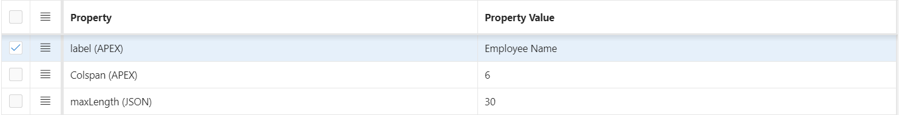

<h2 class="c13" id="h.ki96dhmahe8q">2. Number Input Field</h2>
The&nbsp;Number Input Field&nbsp;is commonly used in Oracle APEX for entering numeric data. It allows users to input values such as quantities, prices, or other numerical information. Number fields can be customized with properties like minimum and maximum values, validation rules, and step values.
<h3 class="c2" id="h.m1zx8dpb41v5">1.1 Field Preview</h3>
Here&rsquo;s a preview of how it looks in a form

<h3 class="c2" id="h.21svau48ddgf">1.2 Defining Field Name and Type</h3>
Enter the Field Name, choose the Field Type, and check &quot;Required&quot; for validation if needed.

<h3 class="c2" id="h.8iqkcdigac7z">1.3 Setting Properties and Values</h3>
Select the Property from the dropdown and manually enter the Property Value. The user is required to input a minimum of 5 and a maximum of 10 digits. Otherwise, the validation will trigger an error message.

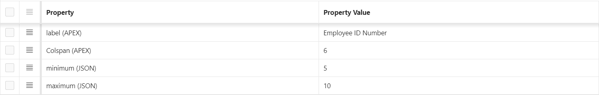

<h2 class="c13" id="h.2vqtn1your4w">3. E-Mail Input Field</h2>
The Email Input Field&nbsp;is commonly used in Oracle APEX for capturing email addresses. It ensures that users provide a valid email format and can be customized with properties such as validation rules and placeholder text. This field helps enforce the correct structure of an email address, improving data accuracy.
<h3 class="c2" id="h.97w45ruzp6h">3.1 Field Preview</h3>
Here&rsquo;s a preview of how it looks in a form

<h3 class="c2" id="h.t0bglgefqx4o">3.2 Defining Field Name and Type</h3>
Enter the Field Name, choose the Field Type, and check &quot;Required&quot; for validation if needed.

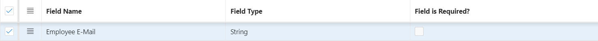
<h3 class="c2" id="h.yphd02lbkux8">3.3 Setting Properties and Values</h3>
Select the Property from the dropdown and manually enter the Property Value. The user is required to input a minimum of 5 and a maximum of 10 digits. Otherwise, the validation will trigger an error message.

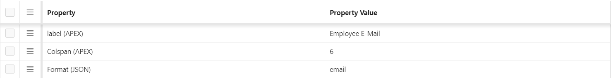

<h2 class="c13" id="h.lllpnhgedb72">4. Dropdown Item</h2>
The Dropdown Item&nbsp;is a widely used component in Oracle APEX for selecting predefined options. It allows users to choose from a list, ensuring data consistency and accuracy. The dropdown can be customized with properties such as default values, dynamic queries, and placeholder text. This component enhances user experience by minimizing input errors and streamlining data entry, making it an essential tool for form design.
<h3 class="c2" id="h.ri8kfufymsu4">4.1 Field Preview</h3>
Here&rsquo;s a preview of how it looks in a form

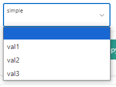
<h3 class="c2" id="h.sj78rtodpini">4.2 Defining Field Name and Type</h3>
Enter the Field Name, choose the Field Type, and check &quot;Required&quot; for validation if needed.

<h3 class="c2" id="h.nsuefsjs84z9">4.3 Setting Properties and Values</h3>
Select the Property from the dropdown and manually enter the Property Value.

<h2 class="c13" id="h.5qrn2jdd8u5p">5. Radio Group</h2>
The Radio Group&nbsp;is a versatile component in Oracle APEX used for selecting a single option from a set of predefined choices. It presents users with a clear and concise way to make selections, enhancing usability. The Radio Group can be customized with properties such as default selections, labels, and layout options. This component promotes data consistency by ensuring that users can only choose one option, making it an effective choice for scenarios where exclusive selections are required.
<h3 class="c2" id="h.9sj6iy30yyr">5.1 Field Preview</h3>
Here&rsquo;s a preview of how it looks in a form

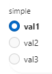
<h3 class="c2" id="h.vs3olf9f5r5w">5.2 Defining Field Name and Type</h3>
Enter the Field Name, choose the Field Type, and check &quot;Required&quot; for validation if needed.

<h3 class="c2" id="h.b3ltb8obpvl7">5.3 Setting Properties and Values</h3>
Select the Property from the dropdown and manually enter the Property Value.

<h2 class="c13" id="h.6xpvugblw2h6">6. Selectone - Dropdown Item</h2>
The Select One - Dropdown Item&nbsp;is a powerful component in Oracle APEX that allows users to choose a single option from a dropdown list. This element is ideal for scenarios where you want to limit user input to a specific set of choices. It can be easily customized with properties such as default selections, dynamic source queries, and placeholder text. By presenting options in a compact format, the Select One - Dropdown Item enhances the user experience while ensuring data integrity and consistency. It is particularly useful in forms where clarity and efficiency are key.
<h3 class="c2" id="h.d9tsvg5pwqx0">6.1 Field Preview</h3>
Here&rsquo;s a preview of how it looks in a form

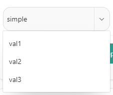
<h3 class="c2" id="h.rc9sypz9srxv">6.2 Defining Field Name and Type</h3>
Enter the Field Name, choose the Field Type, and check &quot;Required&quot; for validation if needed.

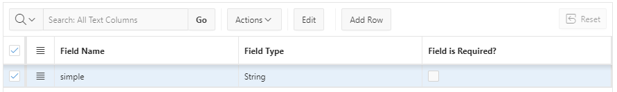
<h3 class="c2" id="h.i254a3ivkivp">6.3 Setting Properties and Values</h3>
Select the Property from the dropdown and manually enter the Property Value.

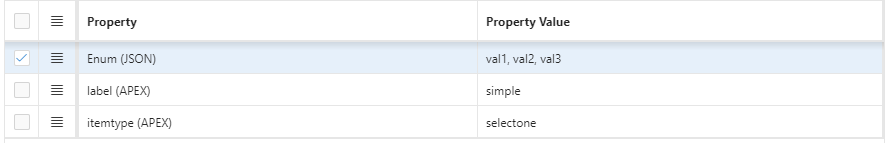
<h2 class="c13" id="h.cnwwqzhvw6jk">7. Date Item</h2>
The Date Item&nbsp;is a key component in Oracle APEX used for capturing date inputs from users. It provides a user-friendly interface, often featuring a calendar picker to simplify date selection. This component can be customized with properties such as default dates, format settings, and validation rules to ensure accurate input. By standardizing date entry, the Date Item enhances data integrity and reduces the likelihood of errors, making it essential for applications that require precise date information. Its intuitive design improves user experience, allowing for seamless data entry in forms.
<h3 class="c2" id="h.sdl005hjrhd1">7.1 Field Preview</h3>
Here&rsquo;s a preview of how it looks in a form

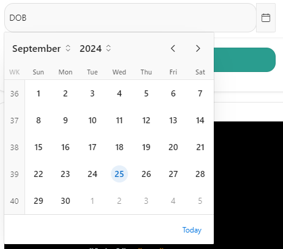
<h3 class="c2" id="h.lsg7zxf3p6vs">7.2 Defining Field Name and Type</h3>
Enter the Field Name, choose the Field Type, and check &quot;Required&quot; for validation if needed.

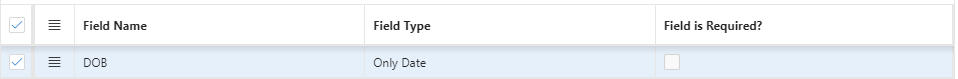
<h3 class="c2" id="h.6j2fm4i7gev">7.3 Setting Properties and Values</h3>
Select the Property from the dropdown and manually enter the Property Value.

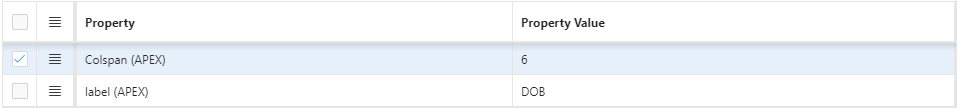
<h2 class="c13" id="h.36356tfwg2y4">8. Combo-Box Item</h2>
The Combo-Box Item&nbsp;is a versatile component in Oracle APEX that combines the functionality of a dropdown list and a text input field. It allows users to either select an option from a predefined list or enter their own value, providing flexibility in data entry. The Combo-Box Item can be customized with properties such as default selections, dynamic source queries, and placeholder text. This feature enhances user experience by accommodating both standard options and unique inputs, making it particularly useful in scenarios where users may need to provide additional context or information. By facilitating a wider range of inputs, the Combo-Box Item promotes data accuracy and efficiency in forms.
<h3 class="c2" id="h.c5jg4hhmzjr3">8.1 Field Preview</h3>
Here&rsquo;s a preview of how it looks in a form

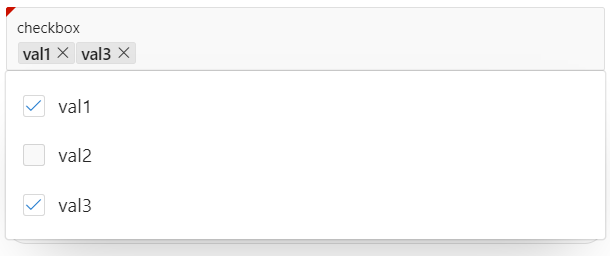
<h3 class="c2" id="h.1ya644tvm4ao">8.2 Defining Field Name and Type</h3>
Enter the Field Name, choose the Field Type, and check &quot;Required&quot; for validation if needed.

<h3 class="c2" id="h.jflcljels6hg">8.3 Setting Properties and Values</h3>
Select the Property from the dropdown and manually enter the Property Value.

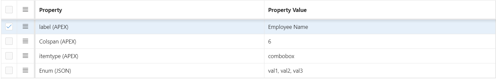
<h2 class="c13" id="h.waomq1r2o7jv">9. Checkbox - Boolean Item</h2>
The Checkbox - Boolean Item&nbsp;is a straightforward component in Oracle APEX used for capturing binary choices, such as yes/no or true/false responses. This item allows users to make a simple selection with a single checkbox, which can be customized with properties such as default values and labels. Its intuitive design makes it easy for users to understand and interact with, ensuring quick and accurate data entry. The Checkbox - Boolean Item is particularly useful in forms where a clear, binary decision is required, helping to streamline workflows and maintain data integrity.
<h3 class="c2" id="h.dumeqikq53qp">9.1 Field Preview</h3>
Here&rsquo;s a preview of how it looks in a form

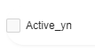
<h3 class="c2" id="h.7evslt5fqzr7">9.2 Defining Field Name and Type</h3>
Enter the Field Name, choose the Field Type, and check &quot;Required&quot; for validation if needed.

<h3 class="c2" id="h.roc29zwygdmx">9.3 Setting Properties and Values</h3>
Select the Property from the dropdown and manually enter the Property Value.

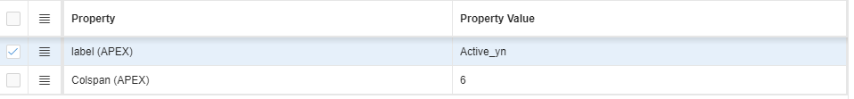

<h1 class="c15 c19" id="h.9n1upc28go4e"></h1><h1 class="c15" id="h.awu1hy1u2k52">Oracle APEX Field Properties Documentation</h1>
In this section, you&#39;ll find a detailed guide on the different field types available in Oracle APEX. We&rsquo;ll walk you through how to create, configure, and customize fields. Each section provides visual examples to help you better understand the process.

<h2 class="c13" id="h.yh13hlq37kil">1. Properties: MaxLength (JSON)</h2>
The MaxLength&nbsp;property in JSON is used to define the maximum number of characters that a text input can accept. This property is crucial for enforcing input constraints and ensuring data integrity in applications. By specifying a MaxLength value, developers can control the length of user inputs, preventing errors caused by excessively long entries.
<h3 class="c2" id="h.6d2jaztw1jma">1.1 Field Preview</h3>
Here&rsquo;s a preview of how it looks in a form

<h3 class="c2" id="h.gg1i3i1gwdxb">1.2 Defining Field Name and Type</h3>
Enter the Field Name, choose the Field Type, and check &quot;Required&quot; for validation if needed.

<h3 class="c2" id="h.yvd785683f9l">1.3 Setting Properties and Values</h3>
Select the Property from the dropdown and manually enter the Property Value.

<h2 class="c13" id="h.xip0f11hp04p">2. Properties: Colspan (APEX)</h2>
In Oracle APEX, the colspan&nbsp;attribute is used in HTML tables to specify the number of columns a cell should span. This attribute is particularly useful when designing forms or reports where you want a single cell to extend across multiple columns, allowing for better organization and presentation of data.
<h3 class="c2" id="h.12sey6cw60ua">2.1 Field Preview</h3>
Here&rsquo;s a preview of how it looks in a form

<h3 class="c2" id="h.lum2dw2yglkb">2.2 Defining Field Name and Type</h3>
Enter the Field Name, choose the Field Type, and check &quot;Required&quot; for validation if needed.

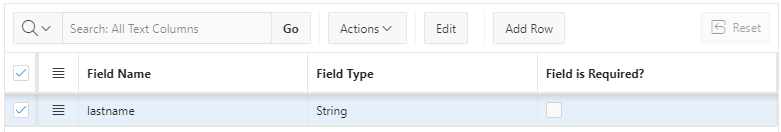
<h3 class="c2" id="h.pmh5te32sy08">2.3 Setting Properties and Values</h3>
Select the Property from the dropdown and manually enter the Property Value.

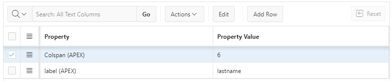
</body></html>