<html><head><meta content="text/html; charset=UTF-8" http-equiv="content-type">

</head><body class="c22 doc-content">

Table of Conent

<a class="c4" href="#h.rwlpv1buq7p9">Oracle APEX Field Documentation</a>

<a class="c4" href="#h.fiolcc6vyx49">1. Text Input Field</a>

<a class="c4" href="#h.ki96dhmahe8q">2. Number Input Field</a>

<a class="c4" href="#h.2vqtn1your4w">3. E-Mail Input Field</a>

<a class="c4" href="#h.lllpnhgedb72">4. Dropdown Item</a>

<a class="c4" href="#h.5qrn2jdd8u5p">5. Radio Group</a>

<a class="c4" href="#h.6xpvugblw2h6">6. Selectone - Dropdown Item</a>

<a class="c4" href="#h.cnwwqzhvw6jk">7. Date Item</a>

<a class="c4" href="#h.36356tfwg2y4">8. Combo-Box Item</a>

<a class="c4" href="#h.waomq1r2o7jv">9. Checkbox - Boolean Item</a>

<a class="c4" href="#h.awu1hy1u2k52">Oracle APEX Field Properties Documentation (JSON)</a>

<a class="c4" href="#h.yh13hlq37kil">1. Properties: MaxLength (JSON)</a>

<a class="c4" href="#h.hsohzz95ynz0">2. Properties: Url(JSON)</a>

<a class="c4" href="#h.3wg4a9aa3ql9">Oracle APEX Field Properties Documentation (APEX)</a>

<a class="c4" href="#h.m5ha58oa29bj">1. Properties: MaxLength (APEX)</a>

<a class="c4" href="#h.e1sihkwmu4gl">2.Properties: Rating(APEX)</a>

<a class="c4" href="#h.e27662pddxdg">3.Properties: Password(APEX)</a>

<a class="c4" href="#h.rn7t7sqgguh2">4.Properties: Lower Textcase(APEX)</a>

<a class="c4" href="#h.7wkzeaa4cf5p">5.Properties: Richtext(APEX)</a>

<a class="c4" href="#h.vcy1rofkqdvn">6.Properties: Switch(APEX)</a>

<a class="c4" href="#h.4jh9r83u43fx">7.Properties: CSS(APEX)</a>

<a class="c4" href="#h.oh1nm9llydp2">8.Properties: TextBefore(APEX)</a>

<a class="c4" href="#h.oqprkhrq4bl1">9.Properties:Align (APEX)</a>

<a class="c4" href="#h.den8srxmmecj">10.Properties: Select (APEX)</a>

<a class="c4" href="#h.xip0f11hp04p">11. Properties: Colspan (APEX)</a>

<a class="c4" href="#h.49w7qb9h6mr">Properties:(APEX)</a>

<a class="c4" href="#h.vh3e9hgmdrlx">Properties:(APEX)</a>

<h1 class="c8" id="h.rwlpv1buq7p9">Oracle APEX Field Documentation</h1>
In this section, you&#39;ll find a detailed guide on the different field types available in Oracle APEX. We&rsquo;ll walk you through how to create, configure, and customize fields. Each section provides visual examples to help you better understand the process.

<h2 class="c1" id="h.fiolcc6vyx49">1. Text Input Field</h2>
The Text Input Field&nbsp;is one of the most commonly used fields in Oracle APEX. It allows users to enter text data, which can range from simple information such as names and addresses to more complex inputs. Text fields can be customized with various properties such as length limits, validation rules, and placeholder text.

Field Preview

Here&rsquo;s a preview of how it looks in a form

Defining Field Name and Type

Enter the Field Name, choose the Field Type, and check &quot;Required&quot; for validation if needed.

Setting Properties and Values

Select the Property from the dropdown and manually enter the Property Value.

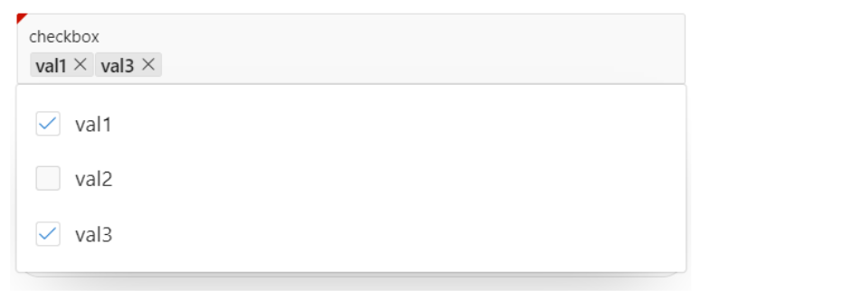

<h2 class="c1" id="h.ki96dhmahe8q">2. Number Input Field</h2>
The&nbsp;Number Input Field&nbsp;is commonly used in Oracle APEX for entering numeric data. It allows users to input values such as quantities, prices, or other numerical information. Number fields can be customized with properties like minimum and maximum values, validation rules, and step values.

Field Preview

Here&rsquo;s a preview of how it looks in a form

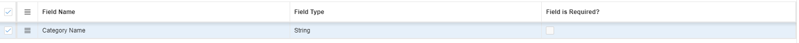

Defining Field Name and Type

Enter the Field Name, choose the Field Type, and check &quot;Required&quot; for validation if needed.

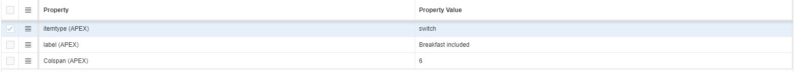

Setting Properties and Values

Select the Property from the dropdown and manually enter the Property Value. The user is required to input a minimum of 5 and a maximum of 10 digits. Otherwise, the validation will trigger an error message.

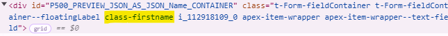

<h2 class="c1" id="h.2vqtn1your4w">3. E-Mail Input Field</h2>
The Email Input Field&nbsp;is commonly used in Oracle APEX for capturing email addresses. It ensures that users provide a valid email format and can be customized with properties such as validation rules and placeholder text. This field helps enforce the correct structure of an email address, improving data accuracy.

Field Preview

Here&rsquo;s a preview of how it looks in a form

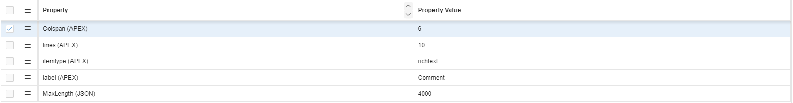

Defining Field Name and Type

Enter the Field Name, choose the Field Type, and check &quot;Required&quot; for validation if needed.

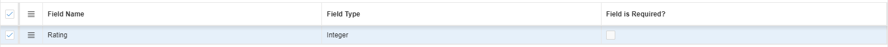

Setting Properties and Values

Select the Property from the dropdown and manually enter the Property Value. The user is required to input a minimum of 5 and a maximum of 10 digits. Otherwise, the validation will trigger an error message.

<h2 class="c1" id="h.lllpnhgedb72">4. Dropdown Item</h2>
The Dropdown Item&nbsp;is a widely used component in Oracle APEX for selecting predefined options. It allows users to choose from a list, ensuring data consistency and accuracy. The dropdown can be customized with properties such as default values, dynamic queries, and placeholder text. This component enhances user experience by minimizing input errors and streamlining data entry, making it an essential tool for form design.

Field Preview

Here&rsquo;s a preview of how it looks in a form

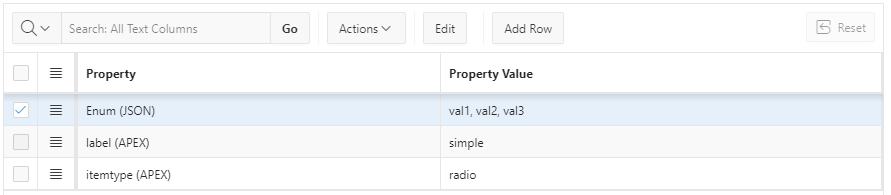

Defining Field Name and Type

Enter the Field Name, choose the Field Type, and check &quot;Required&quot; for validation if needed.

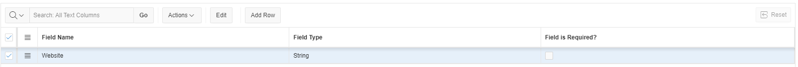

Setting Properties and Values

Select the Property from the dropdown and manually enter the Property Value.

<h2 class="c1" id="h.5qrn2jdd8u5p">5. Radio Group</h2>
The Radio Group&nbsp;is a versatile component in Oracle APEX used for selecting a single option from a set of predefined choices. It presents users with a clear and concise way to make selections, enhancing usability. The Radio Group can be customized with properties such as default selections, labels, and layout options. This component promotes data consistency by ensuring that users can only choose one option, making it an effective choice for scenarios where exclusive selections are required.

Field Preview

Here&rsquo;s a preview of how it looks in a form

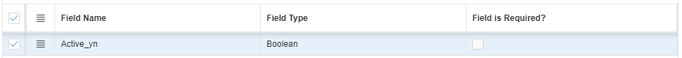

Defining Field Name and Type

Enter the Field Name, choose the Field Type, and check &quot;Required&quot; for validation if needed.

Setting Properties and Values

Select the Property from the dropdown and manually enter the Property Value.

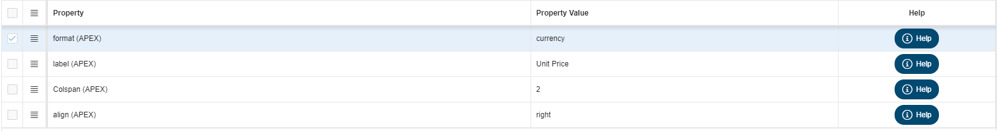
<h2 class="c1" id="h.6xpvugblw2h6">6. Selectone - Dropdown Item</h2>
The Select One - Dropdown Item&nbsp;is a powerful component in Oracle APEX that allows users to choose a single option from a dropdown list. This element is ideal for scenarios where you want to limit user input to a specific set of choices. It can be easily customized with properties such as default selections, dynamic source queries, and placeholder text. By presenting options in a compact format, the Select One - Dropdown Item enhances the user experience while ensuring data integrity and consistency. It is particularly useful in forms where clarity and efficiency are key.

Field Preview

Here&rsquo;s a preview of how it looks in a form

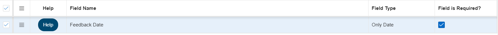

Defining Field Name and Type

Enter the Field Name, choose the Field Type, and check &quot;Required&quot; for validation if needed.

Setting Properties and Values

Select the Property from the dropdown and manually enter the Property Value.

<h2 class="c1" id="h.cnwwqzhvw6jk">7. Date Item</h2>
The Date Item&nbsp;is a key component in Oracle APEX used for capturing date inputs from users. It provides a user-friendly interface, often featuring a calendar picker to simplify date selection. This component can be customized with properties such as default dates, format settings, and validation rules to ensure accurate input. By standardizing date entry, the Date Item enhances data integrity and reduces the likelihood of errors, making it essential for applications that require precise date information. Its intuitive design improves user experience, allowing for seamless data entry in forms.

Field Preview

Here&rsquo;s a preview of how it looks in a form

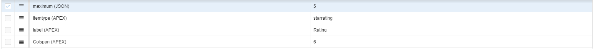

Defining Field Name and Type

Enter the Field Name, choose the Field Type, and check &quot;Required&quot; for validation if needed.

Setting Properties and Values

Select the Property from the dropdown and manually enter the Property Value.

<h2 class="c1" id="h.36356tfwg2y4">8. Combo-Box Item</h2>
The Combo-Box Item&nbsp;is a versatile component in Oracle APEX that combines the functionality of a dropdown list and a text input field. It allows users to either select an option from a predefined list or enter their own value, providing flexibility in data entry. The Combo-Box Item can be customized with properties such as default selections, dynamic source queries, and placeholder text. This feature enhances user experience by accommodating both standard options and unique inputs, making it particularly useful in scenarios where users may need to provide additional context or information. By facilitating a wider range of inputs, the Combo-Box Item promotes data accuracy and efficiency in forms.

Field Preview

Here&rsquo;s a preview of how it looks in a form

Defining Field Name and Type

Enter the Field Name, choose the Field Type, and check &quot;Required&quot; for validation if needed.

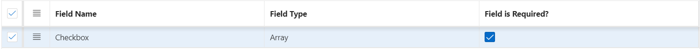

Setting Properties and Values

Select the Property from the dropdown and manually enter the Property Value.

<h2 class="c1" id="h.waomq1r2o7jv">9. Checkbox - Boolean Item</h2>
The Checkbox - Boolean Item&nbsp;is a straightforward component in Oracle APEX used for capturing binary choices, such as yes/no or true/false responses. This item allows users to make a simple selection with a single checkbox, which can be customized with properties such as default values and labels. Its intuitive design makes it easy for users to understand and interact with, ensuring quick and accurate data entry. The Checkbox - Boolean Item is particularly useful in forms where a clear, binary decision is required, helping to streamline workflows and maintain data integrity.

Field Preview

Here&rsquo;s a preview of how it looks in a form

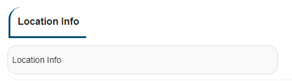

Defining Field Name and Type

Enter the Field Name, choose the Field Type, and check &quot;Required&quot; for validation if needed.

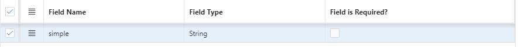

Setting Properties and Values

Select the Property from the dropdown and manually enter the Property Value.

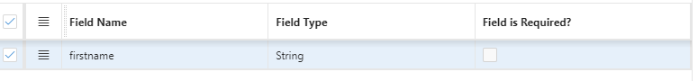

<h1 class="c8 c18" id="h.9n1upc28go4e"></h1><h1 class="c8" id="h.awu1hy1u2k52">Oracle APEX Field Properties Documentation (JSON)</h1>
In this section, you&#39;ll find a detailed guide on the different field types available in Oracle APEX. We&rsquo;ll walk you through how to create, configure, and customize fields. Each section provides visual examples to help you better understand the process.

<h2 class="c1" id="h.yh13hlq37kil">1. Properties: MaxLength (JSON)</h2>
The MaxLength&nbsp;property in JSON is used to define the maximum number of characters that a text input can accept. This property is crucial for enforcing input constraints and ensuring data integrity in applications. By specifying a MaxLength value, developers can control the length of user inputs, preventing errors caused by excessively long entries.

Field Preview

Here&rsquo;s a preview of how it looks in a form

Defining Field Name and Type

Enter the Field Name, choose the Field Type, and check &quot;Required&quot; for validation if needed.

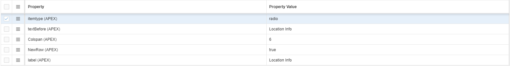

Setting Properties and Values

Select the Property from the dropdown and manually enter the Property Value.

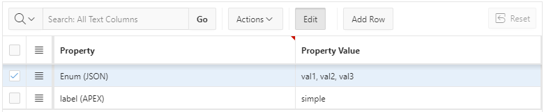

<h2 class="c1" id="h.hsohzz95ynz0">2. Properties: Url(JSON)</h2>
The Url&nbsp;property in JSON is used to define a string that represents a web address, allowing applications to link to external resources or navigate to different pages. This property is essential for creating hyperlinks, directing users to relevant content, or accessing APIs. By specifying a valid URL format, developers can ensure that the links function correctly, enabling smooth navigation and interaction within the application. Proper validation and formatting of the `Url` property help maintain data integrity and enhance the overall user experience.

Field Preview

Here&rsquo;s a preview of how it looks in a form

Defining Field Name and Type

Enter the Field Name, choose the Field Type, and check &quot;Required&quot; for validation if needed.

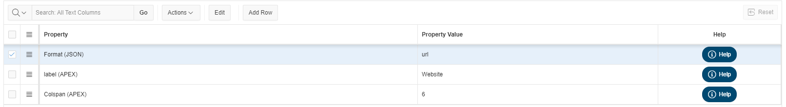

Setting Properties and Values

Select the Property from the dropdown and manually enter the Property Value.

<h1 class="c8" id="h.3wg4a9aa3ql9">Oracle APEX Field Properties Documentation (APEX)</h1>
In this section, you&#39;ll find a detailed guide on the different field types available in Oracle APEX. We&rsquo;ll walk you through how to create, configure, and customize fields. Each section provides visual examples to help you better understand the process.

<h2 class="c1" id="h.m5ha58oa29bj">1. Properties: MaxLength (APEX)</h2>
The MaxLength&nbsp;property in JSON is used to define the maximum number of characters that a text input can accept. This property is crucial for enforcing input constraints and ensuring data integrity in applications. By specifying a MaxLength value, developers can control the length of user inputs, preventing errors caused by excessively long entries.

Field Preview

Here&rsquo;s a preview of how it looks in a form

Defining Field Name and Type

Enter the Field Name, choose the Field Type, and check &quot;Required&quot; for validation if needed.

Setting Properties and Values

Select the Property from the dropdown and manually enter the Property Value.

<h2 class="c1 c20" id="h.jbgkgwyg6b7y"></h2>

<h2 class="c1" id="h.e1sihkwmu4gl">2.Properties: Rating(APEX)</h2>
The StarRating&nbsp;property in Oracle APEX is used to define the maximum number of stars a user can select in a rating item. This property is critical for setting constraints on user feedback and ensuring consistency across the application. By specifying the maximum number of stars, developers can control the rating scale, ensuring that users do not exceed the predefined rating limit, which helps standardize input and maintain data integrity.

Field Preview

Here&rsquo;s a preview of how it looks in a form

Defining Field Name and Type

Enter the Field Name, choose the Field Type, and check &quot;Required&quot; for validation if needed.

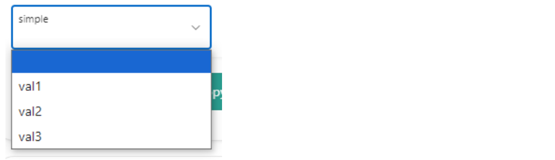

Setting Properties and Values

Select the Property from the dropdown and manually enter the Property Value.

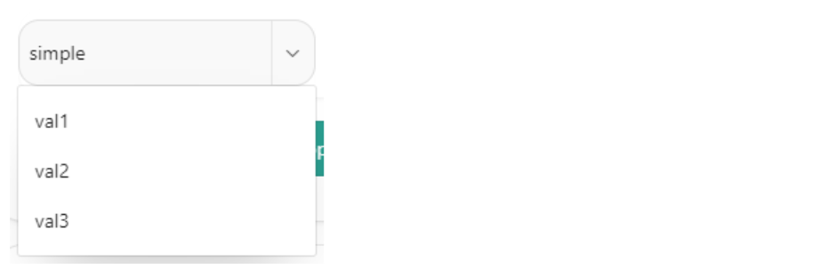

<h2 class="c1" id="h.e27662pddxdg">3.Properties: Password(APEX)</h2>
The Password&nbsp;property in Oracle APEX is used to create an input area where users can securely enter sensitive information, such as passwords. The field automatically masks the characters, ensuring that the entered information remains hidden from view. Developers can also apply validation rules, set minimum or maximum character limits, and enforce password strength requirements. This field is essential for ensuring data security and protecting user credentials in an application.

Field Preview

Here&rsquo;s a preview of how it looks in a form

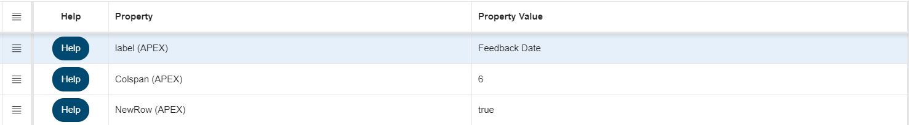

Defining Field Name and Type

Enter the Field Name, choose the Field Type, and check &quot;Required&quot; for validation if needed.

Setting Properties and Values

Select the Property from the dropdown and manually enter the Property Value.

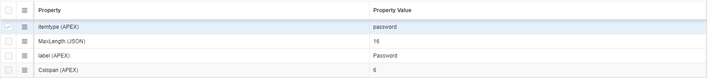

<h2 class="c1" id="h.rn7t7sqgguh2">4.Properties: Lower Textcase(APEX)</h2>
The Lowercase Text&nbsp;property in Oracle APEX ensures that any text entered into a field is automatically converted to lowercase. This property is useful for enforcing consistent data formatting, especially in cases where case sensitivity should be ignored, such as for email addresses or identifiers. By applying this property, developers can prevent case-related discrepancies in user inputs and maintain uniformity throughout the application.

Field Preview

Here&rsquo;s a preview of how it looks in a form

Defining Field Name and Type

Enter the Field Name, choose the Field Type, and check &quot;Required&quot; for validation if needed.

Setting Properties and Values

Select the Property from the dropdown and manually enter the Property Value.

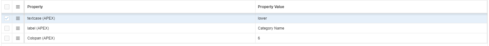
<h2 class="c1" id="h.7wkzeaa4cf5p">5.Properties: Richtext(APEX)</h2>
The Rich Text&nbsp;property in Oracle APEX allows users to enter and format text with various styles, such as bold, italics, lists, and hyperlinks. This property enables a rich text editor in the input field, giving users the flexibility to format their content beyond plain text. It&#39;s particularly useful for areas where detailed content, like descriptions, comments, or blog entries, is needed. By enabling the Rich Text property, developers can enhance the user experience by providing advanced text formatting options within the application.

Field Preview

Here&rsquo;s a preview of how it looks in a form

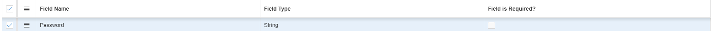

Defining Field Name and Type

Enter the Field Name, choose the Field Type, and check &quot;Required&quot; for validation if needed.

Setting Properties and Values

Select the Property from the dropdown and manually enter the Property Value.

<h2 class="c1" id="h.vcy1rofkqdvn">6.Properties: Switch(APEX)</h2>
The Switch&nbsp;property in Oracle APEX allows developers to create a toggle switch control that users can click to switch between two states, typically &quot;On&quot; and &quot;Off.&quot; This property is ideal for scenarios where users need to enable or disable a setting, select between binary options, or turn a feature on or off. The `Switch` property enhances user experience by providing a visually intuitive and interactive control, making it easy to select between two distinct choices in the application.

Field Preview

Here&rsquo;s a preview of how it looks in a form

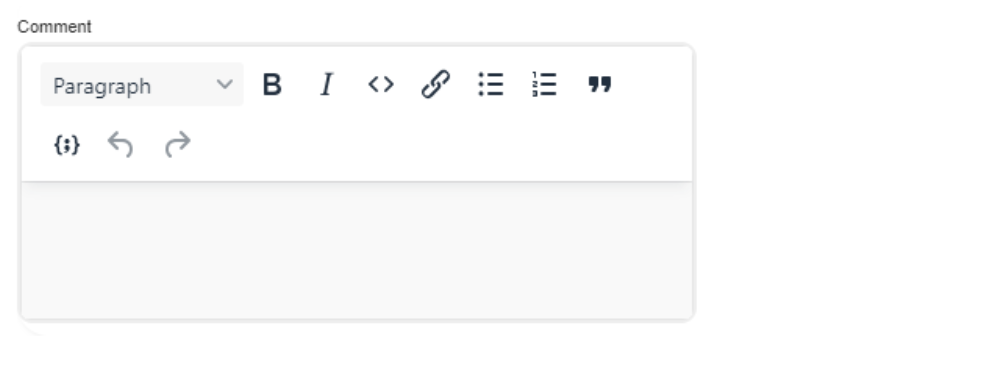

Defining Field Name and Type

Enter the Field Name, choose the Field Type, and check &quot;Required&quot; for validation if needed.

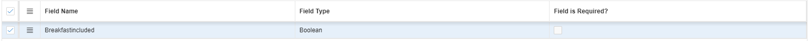

Setting Properties and Values

Select the Property from the dropdown and manually enter the Property Value.

<h2 class="c1" id="h.4jh9r83u43fx">7.Properties: CSS(APEX)</h2>
The CSS&nbsp;property in Oracle APEX allows developers to apply custom styles to elements within the application. This property is used to modify the appearance of components such as buttons, text, regions, and more by defining specific styling rules like colors, fonts, margins, and layout. By using the `CSS` property, developers can enhance the visual design and user interface of the application, ensuring a consistent and customized look that aligns with branding or aesthetic preferences.

Field Preview

Here&rsquo;s a preview of how it looks in a form

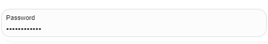

Defining Field Name and Type

Enter the Field Name, choose the Field Type, and check &quot;Required&quot; for validation if needed.

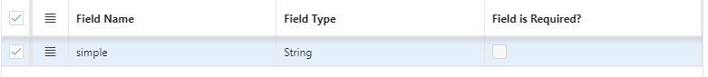

Setting Properties and Values

Select the Property from the dropdown and manually enter the Property Value.

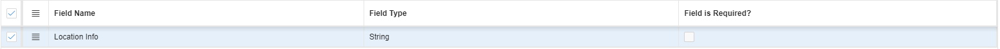

<h2 class="c1" id="h.oh1nm9llydp2">8.Properties: TextBefore(APEX) </h2>
The Text Before&nbsp;property in Oracle APEX allows developers to display custom text or labels directly before a form item or input field. This property is useful for adding context, instructions, or descriptions to help users understand the purpose of the input field. By using the `Text Before` property, developers can provide additional clarity, improving the user experience and ensuring that users enter the correct information into the form.

Field Preview

Here&rsquo;s a preview of how it looks in a form

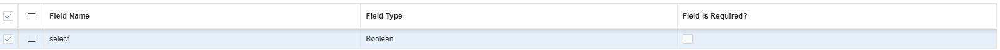

Defining Field Name and Type

Enter the Field Name, choose the Field Type, and check &quot;Required&quot; for validation if needed.

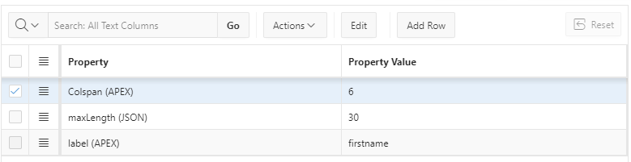

Setting Properties and Values

Select the Property from the dropdown and manually enter the Property Value.

<h2 class="c1" id="h.oqprkhrq4bl1">9.Properties:Align (APEX)</h2>
The Align&nbsp;property in Oracle APEX specifies the alignment of content within a component, such as text, buttons, or regions. This property allows developers to control the positioning of elements, ensuring that they are visually organized according to the desired layout. Options typically include left, center, or right alignment. By using the Align property, developers can enhance the overall aesthetics of the application, improve readability, and create a more user-friendly interface by ensuring that elements are aligned consistently throughout the application.

Field Preview

Here&rsquo;s a preview of how it looks in a form

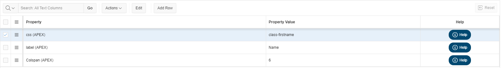

Defining Field Name and Type

Enter the Field Name, choose the Field Type, and check &quot;Required&quot; for validation if needed.

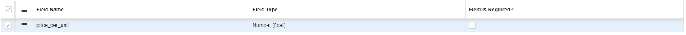

Setting Properties and Values

Select the Property from the dropdown and manually enter the Property Value.

<h2 class="c1" id="h.den8srxmmecj">10.Properties: Select (APEX)</h2>
The Boolean Select&nbsp;property in Oracle APEX is used to create a selection control that represents a true/false or yes/no choice. This property typically presents users with a simple toggle switch or checkbox, making it easy to indicate a binary state. The `Boolean Select` property is ideal for scenarios where a straightforward decision is required, such as agreeing to terms and conditions, enabling features, or confirming preferences. By utilizing this property, developers can streamline user interactions and enhance the clarity of options presented within the application.

Field Preview

Here&rsquo;s a preview of how it looks in a form

Defining Field Name and Type

Enter the Field Name, choose the Field Type, and check &quot;Required&quot; for validation if needed.

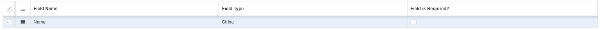

Setting Properties and Values

Select the Property from the dropdown and manually enter the Property Value.

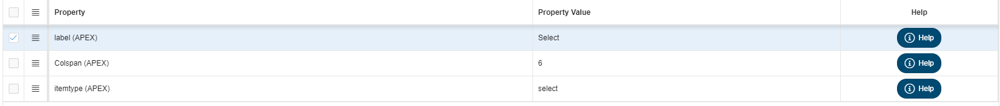

<h2 class="c1" id="h.xip0f11hp04p">11. Properties: Colspan (APEX)</h2>
In Oracle APEX, the colspan&nbsp;attribute is used in HTML tables to specify the number of columns a cell should span. This attribute is particularly useful when designing forms or reports where you want a single cell to extend across multiple columns, allowing for better organization and presentation of data.
<h3 class="c17" id="h.y2mr0l889qaz"></h3>
Field Preview

Here&rsquo;s a preview of how it looks in a form

Defining Field Name and Type

Enter the Field Name, choose the Field Type, and check &quot;Required&quot; for validation if needed.

Setting Properties and Values

Select the Property from the dropdown and manually enter the Property Value.

<h2 class="c1" id="h.49w7qb9h6mr">Properties:(APEX)</h2>

Field Preview

Here&rsquo;s a preview of how it looks in a form

Defining Field Name and Type

Enter the Field Name, choose the Field Type, and check &quot;Required&quot; for validation if needed.

Setting Properties and Values

Select the Property from the dropdown and manually enter the Property Value.
<h2 class="c1" id="h.vh3e9hgmdrlx">Properties:(APEX)</h2>

Field Preview

Here&rsquo;s a preview of how it looks in a form

Defining Field Name and Type

Enter the Field Name, choose the Field Type, and check &quot;Required&quot; for validation if needed.

Setting Properties and Values

Select the Property from the dropdown and manually enter the Property Value.

</body></html>